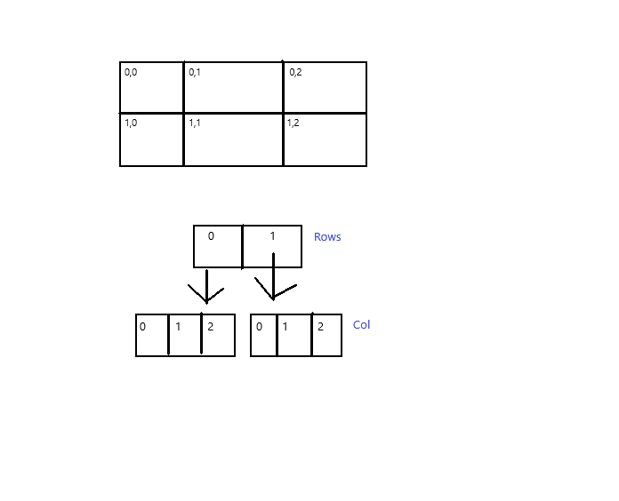
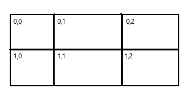
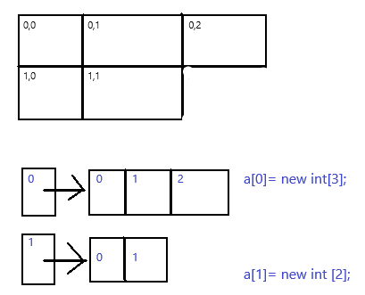
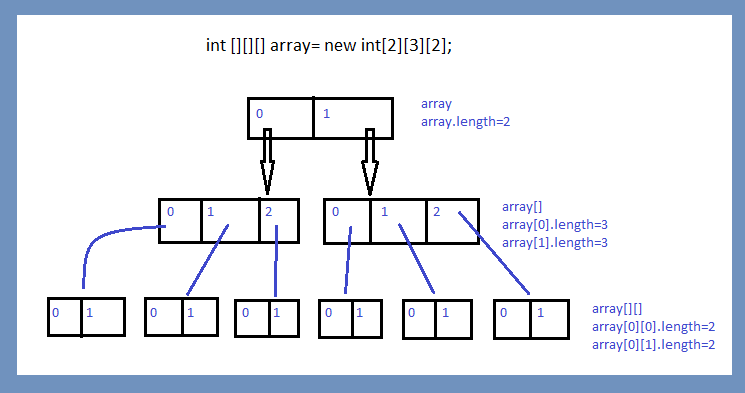

# Array

>Collections of values of the same(Homogeneous) type. 

Object is the super class of the Array. As this is an object then array stores in Heap memory.

**Array Declaration:**  
data_type variable_name [array_size];  
int array[10];

**Array Creation:**  
int number[]= new int[10];

```java
int[] a= new int[0];    //Program compiles & runs properly
int[] b=new int [-3];   //Program will be compiled but thrown error at run time. 
//NegativeArraySizeException
```

**Initialization:**  
Default value assigns in the array index.  
Replacing the default values:
```
number[0]=100;
number[1]=200;
number[2]=300;
number[3]=400;
number[4]=500;
```
Let say an Array in declared with size 3.  
```java
int[] array= new int[3];
array[0]=1; //value assigned
array[1]=2; //value assigned
array[2]=3; //value assigned
array[3]=4; //through ArrayIndexOutOfBoundException 
```
**Declaring Multiple Variables:**  
```
int[] a,b;  //Both a & b are arrays
int []a,b;  //Both a & b are arrays
int a[], b; //a is array but b is primitive variable.
```
**Sum of array elements:**
```java
package array;

import java.util.*;

public class SumOfArrayElements {
	public static void main(String[] args) {
		int array[]= new int[5];
		int sumElements=0;
		
		Scanner scan= new Scanner(System.in);
		
		for(int i=0;i<array.length;i++) {
			array[i]=scan.nextInt();    //1 2 3 4 5
		}
		
		for(int i=0;i<array.length;i++) {
			sumElements+=array[i];
		}
		System.out.println(sumElements);    //15
	}
}
```
**Concepts:**  
```java
int[] a= new int[0];    //Program compiles & runs properly
int[] b=new int [-3];   //Program will be compiled but thrown error at run time. 
//NegativeArraySizeException
```
### 2D Array:

**Representation:**  


**Declarations:**  
```java
int [][] array;     //preferred
int [] [] array;
int array [][];
int [] array[];
```
There are 2 types of array.  
**1. Matrix Array:** Arrays containing same size of the columns are called Matrix Array.  
`int array[][]= new int[2][3];`



**2. Jagged Array:** The array contains different number or columns for each row is called Jagged Array. The column field use to be empty.  

```java
int[][] array= new int [2][];
array [0]= new int[3];
array [1]= new int[2];
```


**Example:**
```java
	public static void main(String[] args) {		
		int[][] array=new int[2][];
		
		array[0]= new int[3];
		array [1]= new int[2];
		
		array[0][0]=20;
		array[0][1]=21;
		array[0][2]=22;
		array[1][0]=10;
		array[1][1]=11;

		for(int i=0;i<array.length;i++) {
			for(int j=0;j<array[i].length;j++) {
				System.out.print(array[i][j]+" ");
			}
			System.out.println();
		}
        /*
        20 21 22 
        10 11 
        */

        System.out.println(array);		//[[I@6adca536. Returning 2D array class. For 2D array [[, for integer I.
		System.out.println(array[0]);	//[I@357246de. Returning 1D array class. For 1D array [, for integer I.
        System.out.println(array.length);		//2 
		System.out.println(array[0].length);	//3
		System.out.println(array[0][0].length);	//Compilation error
	}
```

Different scenarios:  
```java
int [][] a,b;   //a & b both are 2D array
int [] a[],b;   //a is 2D and b is 1D array
int [] a[], b[];    //a & b both are 2D array
int [][] a, b[];    //a is 2D and b is 3D array
int [][] a, []b;    //a is 2D array but compile time error will be thrown for b.
```

### 3D Array

**Declaration and Creation:**  
```java
int [][][] array= new int[2][3][2];
```


**Initialization:**
```java
array[0][0][0]=100;
array[0][0][1]=1;
array[0][1][0]=10;
```
**Example:**
```java
	public static void main(String[] args) {
		
		Scanner scan= new Scanner(System.in); 
		
		int [][][] array= new int[2][3][2];
		System.out.println(array.length);		//2
		System.out.println(array[0].length);	//3
		System.out.println(array[0][0].length);	//2
		
		for(int i=0;i<array.length;i++) {
			for(int j=0;j<array[i].length;j++) {
				for(int k=0;k<array[i][j].length;k++) {
					array[i][j][k]=scan.nextInt();
				}
			}
		}

		for(int i=0;i<array.length;i++) {
			for(int j=0;j<array[i].length;j++) {
				for(int k=0;k<array[i][j].length;k++) {
					System.out.print(array[i][j][k]+" ");
				}
				System.out.println();
			}
			System.out.println();
		}
		

	}
```
### Anonymous Array
>Defining an array without any name is called anonymous array.
If you want to use an array just for once, in that case you don't need to declare or initialize the array. You can use directly an anonymous array. Such as, if you want to pass an array as argument then you need to declare and initialize the array and then pass as an argument.

```java
public static void main(String[] args) {	
		int array[]= {2,3,4};	//declaration and initialization
		sum(array);				//Passing the array as an argument 
	}
	public static void sum(int[] array) {
		int sumArray=0;
		for(int i:array) {
			sumArray+=i;
		}
		System.out.println(sumArray);		
	}
```
But what if, you don't require to declare any array to pass as argument.
```java
	public static void main(String[] args) {	
		sum(new int[] {2,3,4});     //Anonymous array
	}
	public static void sum(int[] array) {
		int sumArray=0;
		for(int i:array) {
			sumArray+=i;
		}
		System.out.println(sumArray);		
	}
```