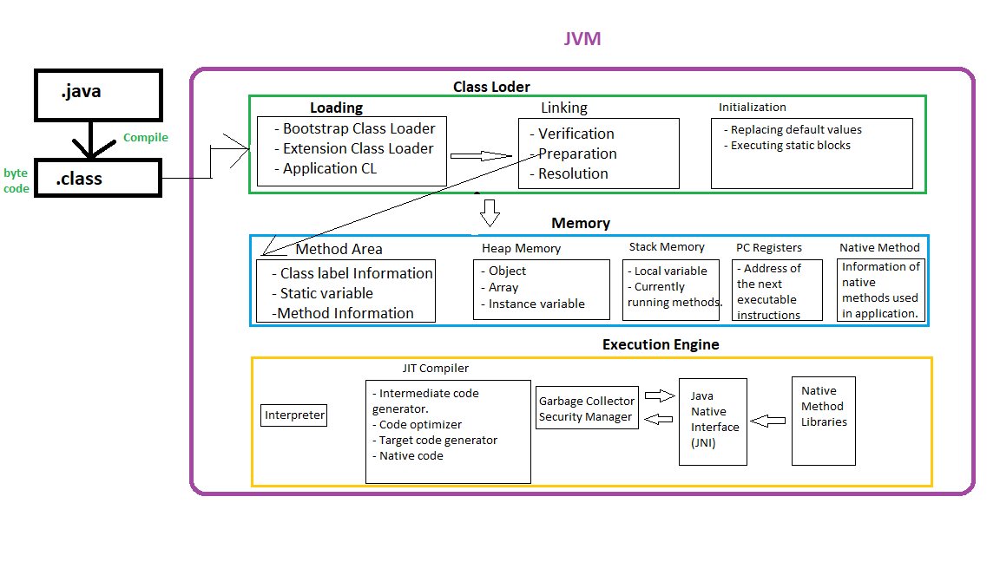

# JVM Architecture

The .class file allocates memory in Method Memory area through Loading components of Class Loader.  

**Class Loader:**  

**Loading:**  Java programmes allocates memory inside the method memory area through Loading phase of class loader.  

Loading contains below components.  
1. Bootstrap Class Loader:  
1. Extension Class Loader
2. Application Class Loader

**Linking:** Linking contains below components.
1. **Verification:** When .class file of Java program loaded then first it is verified through `verification` phase of `Linking`. This process checks whether the .class file is valid or not. If any changes happened in .class file then it will consider the file as invalid. It makes Java secured.  
**2. Preparation:** Allocating Class label data in memory and initialized those with default values. If we consider `int a=10;` then first preparation allocates the memory in method area and initialized with default value `0`. Allocates memory for static variables and initialized with default values.  
**3. Resolution:** Replacing the symbolic names with original names

**Initialization:**  
- Replacing the default values of the static variables.
- Start executing the static blocks.

**Memory:**

**Method Memory:** In Memory area, method area contains class level information. Such as, Class name, variable information, method information etc. Also stores static variables information. Not thread safe.

**Heap Memory:** Object of the class takes place in heap memory. Inside that object, all the information of the method memory will be stored. Array and instance variable also stores in Heap memory. Not thread safe.

**Stack Memory:** Storing local variables and currently running methods. Thread safe.

**PC Register:** Storing the address of the instructions that will be executed next. Thread safe.

**Native Method Memory:** Storing the information of native methods that used in the application. Thread safe.

**Execution Engine:**

**Interpreter:** Executing the code line by line.

**JIT Compiler:** Recognizing the methods that are executing repeatedly and stores the byte code. Just run the byte code again if required further. No need to execute line by line code every time. 