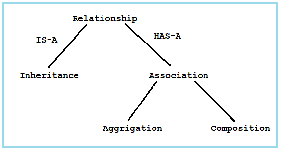

# Relationships between Classes


**Advantages:**  
- Code reusability.
- Reducing redundancy.

**IS-A Relationship:**  
Car extends Vehicle.  
Car is-a Vehicle.

```java
class Students{
    String name;
    int roll_no;
}
```
Student has-a field name.
Student has-a field roll_no.