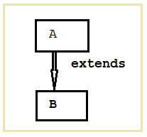
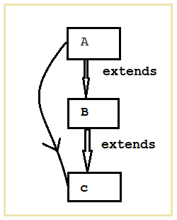
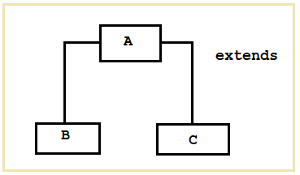
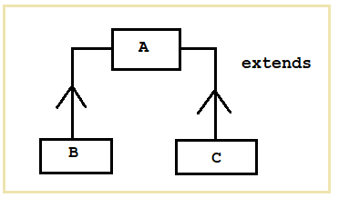

# Inheritance
>The procedure by which one object can access all the properties of it's parent class.

```java
public class Animal {
	
	void recognition(String name) {
		System.out.println("Hello! I am "+name);
	}
}
public class Dog extends Animal{
	public static void main(String[] args) {
		Dog dog= new Dog();
		dog.recognition("Dog");	//Hello! I am Dog
	}

}
public class Cat extends Animal {

	public static void main(String[] args) {

		Cat cat= new Cat();
		cat.recognition("Cat");	//Hello! I am Cat

	}

}
```
**Advantages:**  
- **Code reusability:** Derived classes can use the base class codes.
- **Overriding:** Derived classes can override the methods of base class.
- **Data Hiding:** Derived classes cannot access or modify any methods or codes of base class.

**Disadvantages:**
- **Lack of Independence:** Each class is tightly bounded by each other.
- **Decrease the execution speed:** 
- **Refactoring the code:** If any code is modified in base class then that changes will be reflected in all other derived class.

**Types of Inheritance:**  
1. Single level Inheritance:  
   


```java
public class A {
	
}
public class B extends A{
	public static void main(String[] args) {

	}
}
```
2. Multilevel Inheritance


```java
public class A {
	
}
public class B extends A{

}
public class C extends B{

}
```
3. Hierarchical Inheritance


```java
public class A {
	
}
public class B extends A{

}
public class C extends A{

}
```
4. Multiple Inheritance



Multiple inheritance is not possible in Java.
```java
public class B {
    void print(){
        System.out.println("Multiple Inheritance");
    }
	
}
public class C{
    void print(){
        System.out.println("Multiple Inheritance");
    }
}
public class A extends B extends C{
    A a= new A();
    a.print();
}
```
Here, the object a will be confused on which print() method will be invoked.