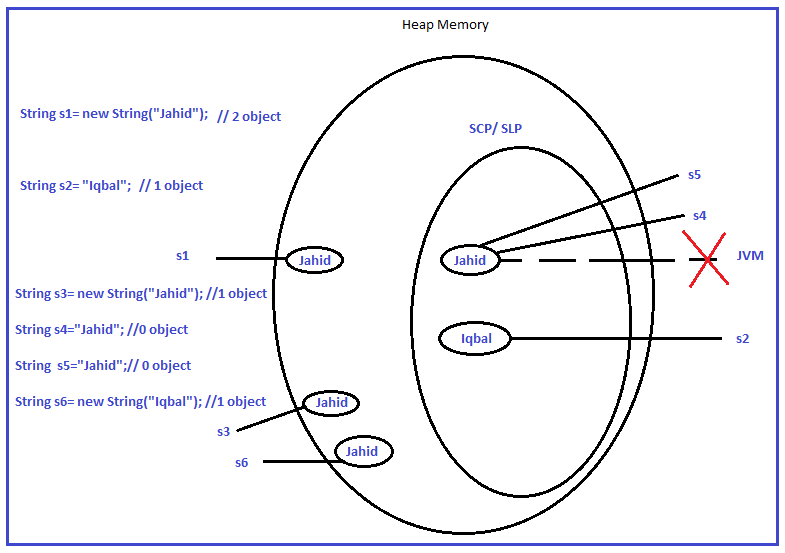
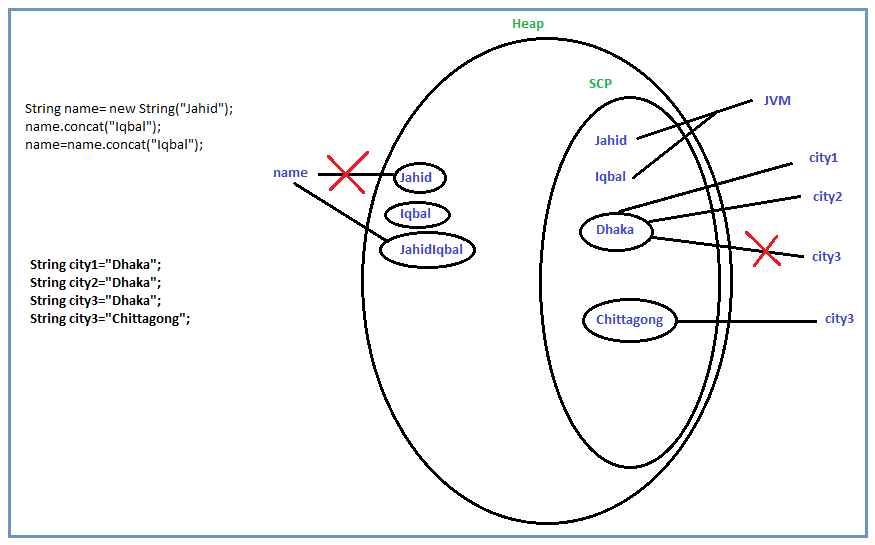

# String

>String is nothing but a sequence of characters or Array of characters.

String is a non-Primitive Data Type. Because it has no fix length. In Java, to represent the character sequence, it introduces an interface called charSequence.

String is a class which inherits Object and implements charSequence.

Original syntax of String class is as below.
```java
public final class String extends Object implement charSequence, Serializable, Comparable{

}
```
As String is a class, so you can create object of String class. That object will be immutable.

You can create object of String class in 2 ways. Such as,
```java
String s1= new String("Jahid");
String s2= "Iqbal";
```
**Q. What is the difference between this 2 object?**  

  

Two objects are created `s1` and `s2`. s1 object takes place in Heap memory but the literal of the object takes place in SCP memory. That literal is referenced by JVM internally. So, `s1` creates 2 object.

`s2` object allocates memory inside SCP memory. `s2` creates 1 object.

<font color="skyblue">The main difference between s1 and s2 object is based on the memory allocation. s1 allocates memory in Heap and SCP but s2 allocates memory only inside SCP.</font>

**<font color="naviblue">Q. What if multiple objects are created with same literal?</font>**

```java
String s1= new String("Jahid"); //2 object
String s2= "Iqbal";             //1 object
String s3=  new String("Jahid"); //1 object
String s4= "Jahid";             //0 object
String s5= "Jahid";             //0 object
String s6=  new String("Iqbal"); //1 object
```
s1 creates 2 object. 1 is inside Heap and another one is in SCP. s1 creates object literal inside SCP. s3 creates object in Heap memory but doesn't inside SCP. Because SCP already contains the same literal. SCP doesn't create duplicate literal. s4 doesn't create any object as the literal already exist in SCP. So just replace the JVM internal reference with s4. s5 also doesn't create any object as the literal already exist. So, just refers the existing literal which is referred by s4 already. s6 creates 1 object inside Heap and no object inside SCP as the literal is duplicate.

**String Constant Pool (SCP):**  
Another name of SCP is **String Literal Pool (SLP)**. This is a memory space inside the Heap memory. Inside the SCP area Garbage Collector doesn't work as JVM internally creates reference variable for each literal object. Creating duplicate literal is not allowed inside the SCP memory.  
Till Java version 1.6 SCP was located inside Method memory area. From Java version 1.7 SCP is located inside the Heap memory. As, it can changes the own size as required in Heap memory but this luxury was not available in Method memory.

**<font color="naviblue">Q. What does Immutable means? Why String objects are Immutable?</font>**  



Immutable means the original literal of the object doesn't change. If any changes happens in the string literal then system creates a new object for that but doesn't bother the original object.

```java
String name= new String("Jahid");
name.concate("Iqbal");
System.out.println(name);    //Jahid
name=name.concate("Iqbal");
System.out.println(name);    //JahidIqbal
```
name object is referred to literal `Jahid`. Then that literal updated to `JahidIqbal`. But the original or first object didn't change anyway. Just created a new object for the new literal `JahidIqbal` and change the reference accordingly. That is called Immutable.

String is Immutable,  
Let say, city1, city2, city3 are referred to a same string literal `Dhaka`. So in some phase, the literal of city3 is changed. In the case of Mutable, the original object will be changed. So, the changes will be reflected for all the variable those are pointed to that object. As String is Immutable, so it creates a new object with the new literal and referred to assigned variable. So, none of the other variable will be impacted.

Real life Example: Just think of selecting country while creating profile in facebook. Let say 100k people selected the same country. One of them changed his country afterwards. As String is Immutable, system creates a new object of that person only and previous object would be unchanged. Otherwise country would be changed for all 100k people.

**<font color="naviblue">Q. Why String class is declared as final?</font>**

**final:**  If you don't want to give permission to any class to be extended then that class can be declared as final. So, final classes can not be inherited or extended. Any final method can not be overridden as well. The value of the final variable also can not be changed.

String class is final because of protecting all the features of the String class. The security is also a concern of it.

**Difference between final and Immutable:**  
```java
final StringBuffer sb = new StringBuffer("Jahid");
sb=sb.append("Iqbal");  //error
sb.append("Iqbal");
System.out.println(sb);   //JahidIqbal
```
When an object os declared as final then that object cannot be reassigned. If you append or add content the original object will be updated with new content. Like as, system updated the original object literal to `JahidIqbal` after appending `Iqbal`.  
But in Immutable case, original object doesn't change. Creating new object instead.

```java
package string;

public class StringDemo01 {
	public static void main(String[] args) {
		String s1="Hello world!";
		String s2= new String("New String");
		
		System.out.println(s1);     //Hello world!
		System.out.println(s2);     //New String
	}
}
```

**Important Methods:**  

**`equal(Object o):boolean`:**  
Compares this string with specified object or string.  
Returns true if the argument is not null and the content of both objects are exactly same.
```java
	public static void main(String[] args) {
		String s1="New String";
		String s2= new String("New String");
		
		if(s1.equals(s2))
			System.out.println("Equal");
		else
			System.out.println("Not Equal");
	}
    //Equal
```
**`equalIgnoreCase(Object o):boolean`:**  
Compares this string with specified object or string ignoring the case.  
Returns true if the argument is not null and the content of both objects are exactly same.
```java
	public static void main(String[] args) {
		String s1="New String";
		String s2= new String("new String");
		
		if(s1.equals(s2))						//Not Equal
			System.out.println("Equal");
		else
			System.out.println("Not Equal");
	
		if(s1.equalsIgnoreCase(s2))				//Equal
			System.out.println("Equal");
		else
			System.out.println("Not Equal");
	}
```

**`contains(CharSequence s):boolean`:**  
Returns true if the String contains the specified object or string.
```java
	public static void main(String[] args) {
		String s1="new String";
		String s2= new String("New String");
	
		System.out.println(s1.contains("tri"));		//true
		System.out.println(s1.contains(s2));		//false
	}
```
**`isEmpty():boolean`:**  
Check whether the string empty or not. Calling the `length()` method implicitly. If `length()` method returns `0` then `isEmpty()` method returns `true`.  
Returns true if the String is empty, false otherwise.

```java
	public static void main(String[] args) {
		String s1="";
		String s2= new String("New String");
	
		System.out.println(s1.isEmpty());		//true
		System.out.println(s2.isEmpty());		//false
	}
```
**`concat(String s):String`:**  
Concatenates the specified string at the end of the string. If the arguments string length is 0 then return this string.
```java
	public static void main(String[] args) {
		String firstName="Abdullah Bin";
		String lastName= new String(" Omar");
	
		System.out.println(firstName.concat(lastName));     //Abdullah Bin Omar
	}
```
**`toUpperCase():String`:**  
Converts each character of the string to upper case letter and return the string.
```java
	public static void main(String[] args) {
		String firstName="Abdullah";
	
		System.out.println(firstName.toUpperCase());	//ABDULLAH
	}
```
**`toLowerCase():String`:**  
Converts each character of the string to lower case letter and return the string.

```java
	public static void main(String[] args) {
		String firstName="Abdullah";
	
		System.out.println(firstName.toLowerCase());	//abdullah
	}
```

**`startsWith(String prefix):boolean`:**  
Check whether the string starts with the specified prefix or not. If yes then return true.

```java
	public static void main(String[] args) {
		String firstName="Abdullah";
	
		System.out.println(firstName.startsWith("Ab"));	//true
		System.out.println(firstName.startsWith("bd"));	//false
	}
```

**`endsWith(String suffix):boolean`:**  
Check whether the string ends with the specified suffix or not. If yes then return true.

```java
    public static void main(String[] args) {
		String firstName="Abdullah";
	
		System.out.println(firstName.endsWith("ah"));	//true
		System.out.println(firstName.endsWith("bd"));	//false
	}
```

**`charAt(int index):char`:**  
Return the character at the specified position.
```java
	public static void main(String[] args) {
		String firstName="Abdullah";
	
		System.out.println(firstName.charAt(0));	//A
		System.out.println(firstName.charAt(5));	//l
	}
```
**`codePointAt(int index):int`:**  
Returns the unicode code point of the character at the specified position ranges from 0 to length()-1.

```java
	public static void main(String[] args) {
		String firstName="Abdullah";
	
		System.out.println(firstName.codePointAt(0));	//65
		System.out.println(firstName.codePointAt(5));	//108
	}
```
**`indexOf(char c):int`:**  
Returns the index of the first occurrence of the specified character. Returns -1 if the element is not found.
```java
	public static void main(String[] args) {
		String firstName="Abdullah";
	
		System.out.println(firstName.indexOf("b"));	//1
		System.out.println(firstName.indexOf("a"));	//6
	}
```
**`lastIndexOf(char c):int`:**  
Returns the index of the last occurrence of the specified element. Returns -1 if the element is not found. 
```java
	public static void main(String[] args) {
		String firstName="Abdullah Bin Omar";
	
		System.out.println(firstName.lastIndexOf("a"));	//15
		System.out.println(firstName.lastIndexOf("A"));	//0
	}
```

**`trim():String`:**  
Removes all the spaces from forward and backward side of a sentence and returns the string.  Such as, In below example 2 spaces are available in string "  Abdullah Bin Omar". trim() method removes those.
```java
	public static void main(String[] args) {
		String firstName="  Abdullah Bin Omar";
		String blankSpace="    ";
	
		System.out.println(firstName.trim());	//Abdullah Bin Omar
		System.out.println(blankSpace.trim());	//	
	}
```
**`replace(char oldChar, char newChar):String`:**  
Replace the oldChar by newChar and returns the new string. If oldChar doesn't find in their string then returns this string.

```java
	public static void main(String[] args) {
		String firstName="Abdullah Bin Omar";
		
		System.out.println(firstName.replace("O", "U"));	//Abdullah Bin Umar
        System.out.println(firstName.replace("Bin", "Ibn"));	//Abdullah Ibn Omar
	}
```
**`split(String regex): String[]`:**  
Splits the string depending on the specified regular expression and returns an Array of string.
```java
	public static void main(String[] args) {
		String firstName="Abdullah Bin Omar";
		
		String[] s=firstName.split(" ");
		
		for(String x: s) {
			System.out.println(x);
		}
        //Abdullah
        //Bin
        //Omar
	}
```
